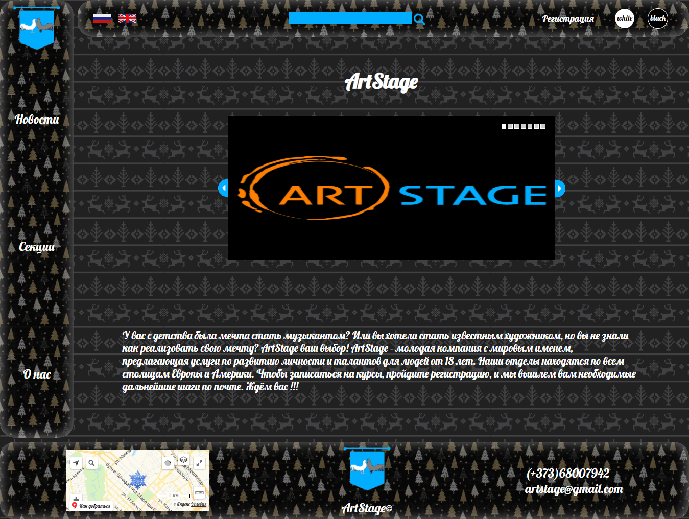
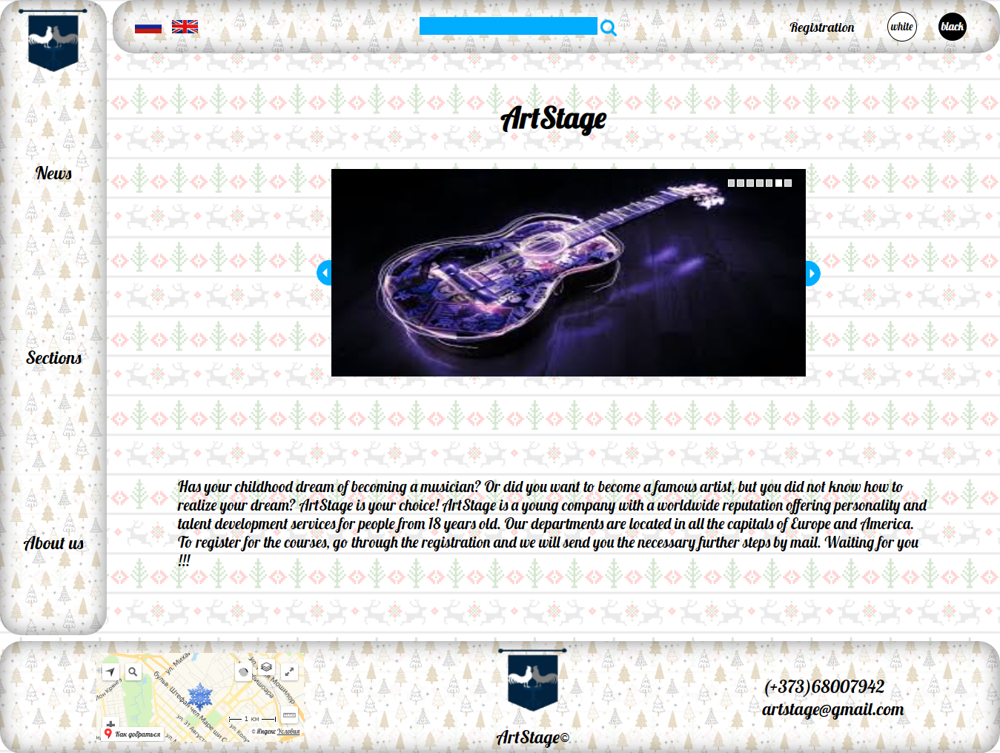
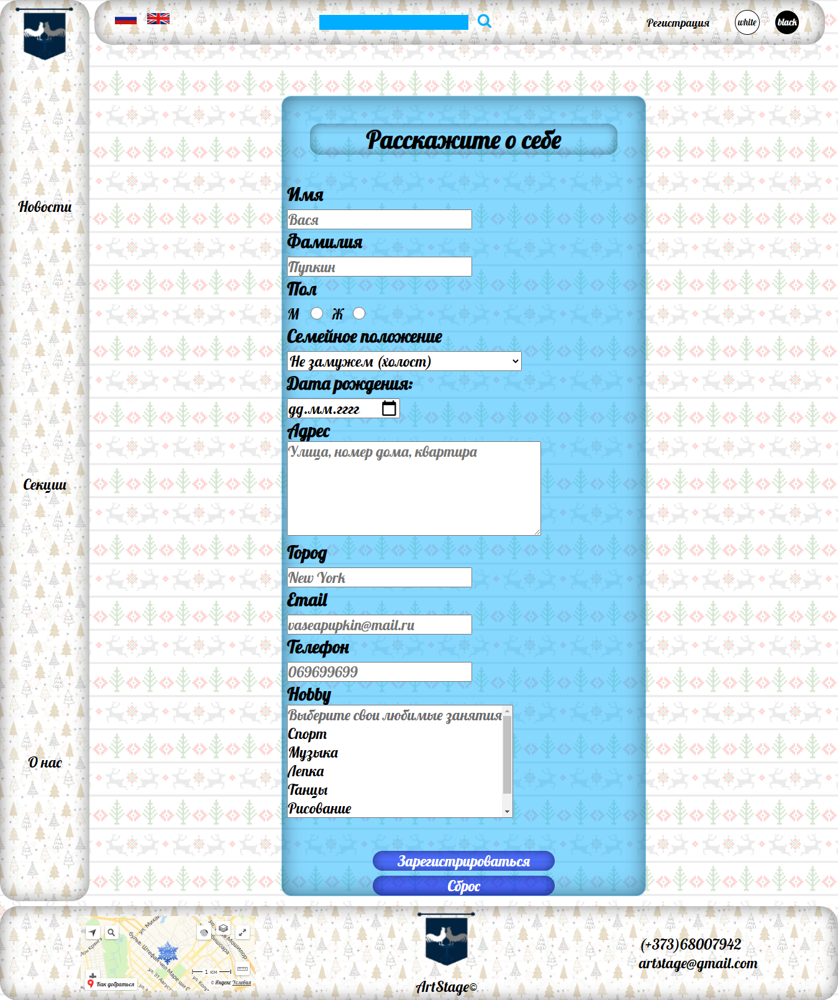
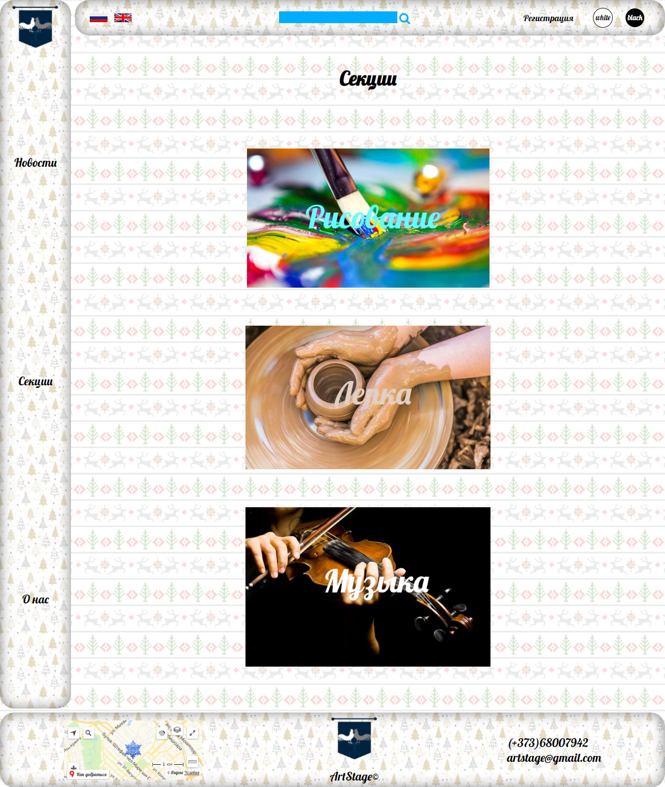

# Installation
1. `Download OpenServer`
2. `Open PhpMyAdmin`
3. `Import Sql dump from creative_center.sql`
4. `Copy project folder to ospanel/domains folder`
5. `Run OpenServer`
6. `Click to MySites art-stage`

# Features
* dark & light theme & christmas design
* language toggle
* registration
* mysql integration
* glogal searching
* carousel
* yandex maps integration

# Screenshots

